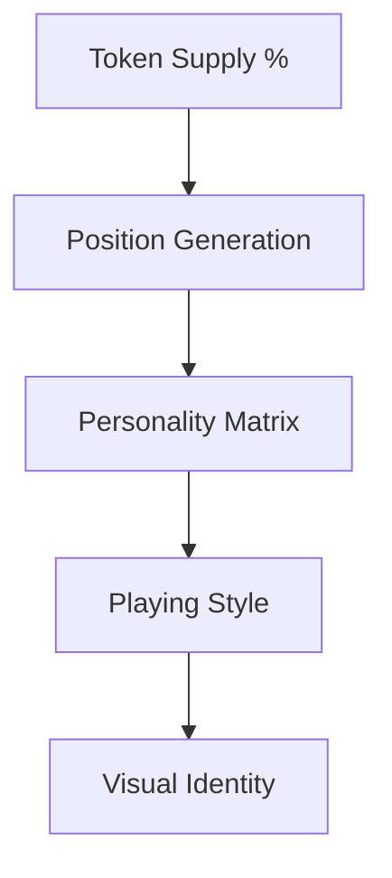

ChessAI Genesis: Supply-Driven Chess Intelligence 🧠♟️

The First True On-Chain Chess Identity

Play chess on the blockchain

Unlike other "AI" projects that simply use existing models or basic randomization, ChessAI Genesis uses my proprietary AI engine developed in 2023. This isn't just another token – it's a living, breathing chess entity that:

- Creates unique chess positions based on your supply percentage
- Develops distinct playing strategies tied to token amount
- Evolves its gameplay based on holder interaction
- Generates visual representations that reflect its personality

🎯 How Supply Shapes Intelligence



Supply-Driven Features
- **1-5% Holdings**: Aggressive pawn structures, high-risk plays
- **5-10% Holdings**: Balanced positional play, strategic development
- **10%+ Holdings**: Complex strategic patterns, master-level calculations

🧠 The AI Engine Difference

What makes the AI special:
- **Advanced Pattern Recognition**: Developed over 12 months of training
- **Supply-Based Learning**: AI characteristics scale with holding size
- **Unique Position Generation**: No two tokens play the same way
- **On-Chain Verification**: Every move and pattern is verifiable

Real Chess Intelligence
```typescript
interface ChessIdentity {
    supplyPercentage: number;
    personalityMatrix: string;
    playStyle: AICharacteristics;
    evolutionStage: number;
}
```

💎 Token Mechanics

Your holdings directly influence:
1. Opening move preferences
2. Tactical pattern recognition
3. Strategic depth calculation
4. Piece movement style
5. End-game behavior

